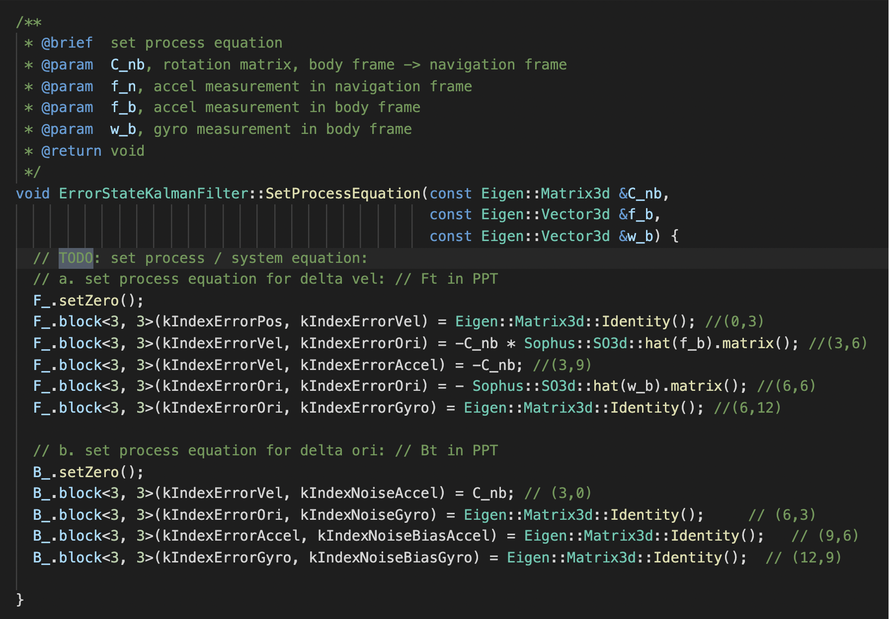
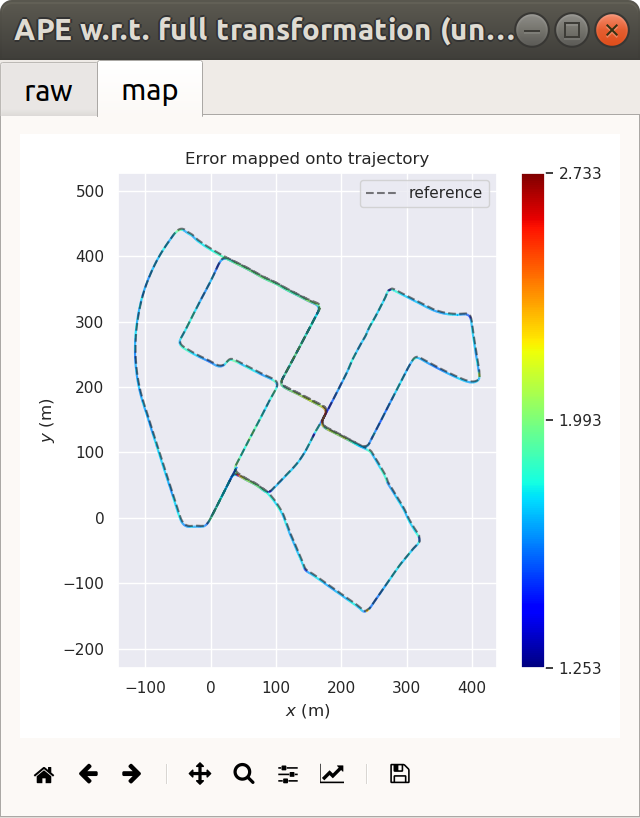

# Multi-Sensor Fusion for Localization & Mapping: Filtering Basic -- 多传感器融合定位与建图: 基于滤波的融合方法I

深蓝学院, 多传感器融合定位与建图, 第7章Filtering Basic代码框架.

---

## Overview

本作业旨在加深对**基于滤波的融合方法**的理解.

---

## 提示

本框架在发布前, **只会在课程提供的Docker环境下进行测试**. 

**若依然选择在Native环境下开发**, 因为没有人比你自己更了解你的环境, 则默认你:

* 拥有足够的环境配置管理能力
* 遇到问题时可以**自行寻找相关资源解决**. 

---

## Getting Started

### 及格要求: 补全代码，且滤波功能正常

启动Docker后, 打开浏览器, 进入Web Workspace. 启动Terminator, 将Shell的工作目录切换如下:


在**上侧**的Shell中, 输入如下命令, **编译lidar_localization**. 如遇到错误, 且非首次编译, 请尝试执行**catkin clean**, 清理catkin cache.

```bash
# build:
catkin config --install && catkin build lidar_localization
# set up session:
source install/setup.bash
# launch:
roslaunch lidar_localization kitti_localization.launch
```

在**下侧**的Shell中, 输入如下命令, **Play KITTI ROS Bag**. **如果机器的配置较低, 可以降低播放速率**.

**注意**: 两个数据集均可用于完成课程, 对代码功能的运行没有任何影响, 区别在于第一个有Camera信息

```bash
# play ROS bag, full KITTI:
rosbag play kitti_2011_10_03_drive_0027_synced.bag
# play ROS bag, lidar-only KITTI:
rosbag play kitti_lidar_only_2011_10_03_drive_0027_synced.bag
```

成功后, 可以看到如下的RViz Visualization. 其中:

* **黄色**轨迹为**GNSS Localization**, 此处用作**Ground Truth**

* **蓝色**轨迹为**ESKF Fused Estimation**


此Demo为参考答案的演示效果. **在你完成作业之前, 你将不会看到如此稳定的蓝色轨迹, 若未实现ESKF, 蓝色轨迹会快速发散**. 你的任务是自行实现精度尽可能高的解算方法. 期待你的精彩发挥!

请搜索TODO, 开始你的编码 :P. 此处将完成作业相关的配置汇总如下. 所有的改动仅需在如下三个文件中进行:

* **Hyper Params** [here](src/lidar_localization/config/filtering/kitti_filtering.yaml#L109)
    
    * 地图以及Scan Context Data输入路径
    
    * ESKF / IEKF参数配置

* **ESKF Interface** [here](src/lidar_localization/include/lidar_localization/models/kalman_filter/error_state_kalman_filter.hpp)

    * ESKF接口定义

* **ESKF Implementation** [here](src/lidar_localization/src/models/kalman_filter/error_state_kalman_filter.cpp)

    * ESKF实现


### Answer: 补全代码、编译运行.

#### in error_state_kalman_filter.cpp [here](src/lidar_localization/src/models/kalman_filter/error_state_kalman_filter.cpp)

#### understand ESKF workflow


#### update IMU odometry estimation: 这里主要是惯性导航解算流程,就是对下面四个方法的调用, 分别get和 update角速度(R)的变化, get和update线速度(t)的变化.


#### 填写B矩阵和F矩阵，对应课程中的PPT



#### 这里对应PPT中B(k-1), 以及5个经典Kalman公式中的第1个 P(k) = F(k-1) * P(k-1) + B(k-1) * Q(k)


#### 通过位姿观测来更正误差估计，对应于5个经典Kalman公式中的第3个


#### 进行Kalman滤波更正误差估计，对应于5个经典Kalman公式中的第4和第5个


#### 采用ESKF的状态来更正误差估计


### Compilation 


### Filter Results in Rviz


### 良好要求: 补全代码，功能正常，且经过调试参数，滤波后性能比滤波前好 (请将详细的误差对比结果提供在作业中，供助教有足够依据评阅)

相比及格要求, 变化不大, 编码完成后, 保存结果, 进行**evo**评估即可.

为了获取可用于**evo评估**的轨迹输出, 可通过如下`ROS Service Call`, 比较融合前后的Odometry: 

```bash
# set up session:
source install/setup.bash
# save odometry:
rosservice call /save_odometry "{}"
# run evo evaluation:
# a. laser:
evo_ape kitti ground_truth.txt laser.txt -r full --plot --plot_mode xy
# b. fused:
evo_ape kitti ground_truth.txt fused.txt -r full --plot --plot_mode xy
```

### Answer: 调教参数，对比精度.

#### Before tuning parameters:


#### After tuning parameters:





### 优秀要求: 在前面的模型推导中, 考虑了器件误差中的随机游走, 请给出不考虑随机游走模型时的推导过程，并在工程框架中实现。对比这两种方法的性能差异(最好给出原因分析)。另外，kalman滤波的性能对噪声的设置较为敏感，请在提供结果的同时，给出不同噪声设置情况下的结果对比(至少5组参数)

此处留白, 把舞台全部交给勇敢挑战优秀的你. 期待你的精彩发挥!
