# Multi-Sensor Fusion for Localization & Mapping: Graph Optimization -- 多传感器融合定位与建图: 基于图优化的建图方法

深蓝学院, 多传感器融合定位与建图, 第9章Graph Optimization for Mapping代码框架.

---

## Overview

本作业旨在加深对**基于图优化的建图方法**的理解.

在IMU的预积分中, 课程只提供了残差对部分变量的雅可比, 请推导残差对其它变量的雅可比, 并在建图流程的代码中补全基于IMU预积分的融合方法中的待填内容，随后与不加IMU融合时的效果进行对比.

---

## Getting Started

### 及格要求: 公式推导正确, 补全代码之后功能正常

**公式推导**部分: 干就完了! 如果理论知识有较大欠缺, 推荐参考深蓝学院VIO课程中的相关内容

**补全代码**部分:

启动Docker后, 打开浏览器, 进入Web Workspace. 启动Terminator, 将Shell的工作目录切换如下:

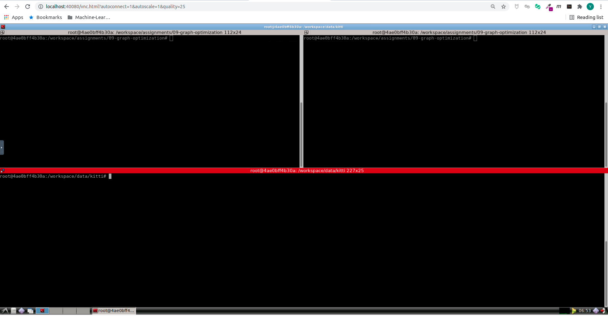

在**上侧**的Shell中, 输入如下命令, **编译lidar_localization**. 如遇到错误, 且非首次编译, 请尝试执行**catkin clean**, 清理catkin cache.

```bash
# build:
catkin config --install && catkin build lidar_localization
# set up session:
source install/setup.bash
# launch:
roslaunch lidar_localization lio_mapping.launch
```

在**下侧**的Shell中, 输入如下命令, **Play KITTI ROS Bag**. 如果机器的配置较低, 可以降低播放速率.

**注意**: 两个数据集均可用于完成课程, 对代码功能的运行没有任何影响, 区别在于第一个有Camera信息

```bash
# play ROS bag, full KITTI:
rosbag play kitti_2011_10_03_drive_0027_synced.bag
# play ROS bag, lidar-only KITTI:
rosbag play kitti_lidar_only_2011_10_03_drive_0027_synced.bag
```

在**运行结束后**, 可以执行如下的命令, **保存地图与Loop Closure Metadata**

```bash
# set up session:
source install/setup.bash
# force backend optimization:
rosservice call /optimize_map
# save optimized map:
rosservice call /save_map 
# if you still use refence Scan Context Loop Closure implementation, execute this command.
rosservice call /save_scan_context 
```

如遇到显示问题, 可以Reset RViz, 然后再次使用/optimize_map服务. 优化对系统资源要求很高, 请耐心等待.

上述三个ROS Service会生成所需的**Map**与**Scan Context Data**. 分别位于:

* **Map**: src/lidar_localization/slam_data/map
* **Scan Context Data**: src/lidar_localization/slam_data/scan_context

成功后, 可以看到如下的RViz Visualization.

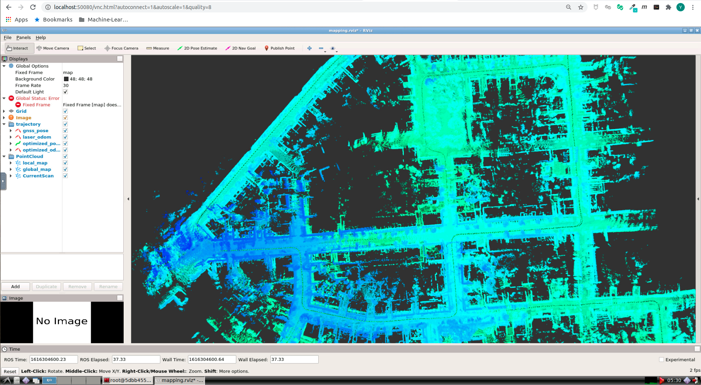

**此Demo为参考答案的演示效果**. 若未实现, 你将无法看到Demo的效果. **请你尝试理解框架, 在其中补完相关逻辑, 实现基于图优化的建图**. 你的任务是自行实现精度尽可能高的解算方法. 期待你的精彩发挥!

请搜索TODO, 开始你的编码 :P. 

此处将完成作业相关的配置汇总如下:

* **IMU Pre-Integration** [here](src/lidar_localization/src/models/pre_integrator/imu_pre_integrator.cpp#L178)

* **G2O Vertex / Edge for IMU Pre-Integration**
    * **Key Frame Vertex** [here](src/lidar_localization/include/lidar_localization/models/graph_optimizer/g2o/vertex/vertex_prvag.hpp)
    * **IMU Pre-Integration Edge** [here](src/lidar_localization/include/lidar_localization/models/graph_optimizer/g2o/edge/edge_prvag_imu_pre_integration.hpp)

* **Module Hyper Params.**
    * **LIO Backend Config** [here](src/lidar_localization/config/mapping/lio_back_end.yaml)


## Answers: 

**公式推导**

#### 位置position残差雅可比

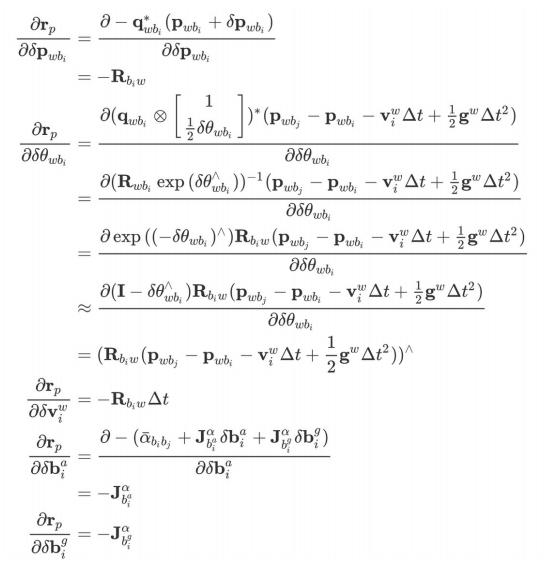
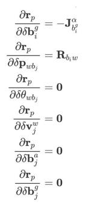

#### 姿态pose残差雅可比

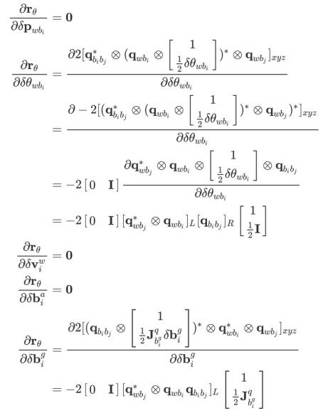
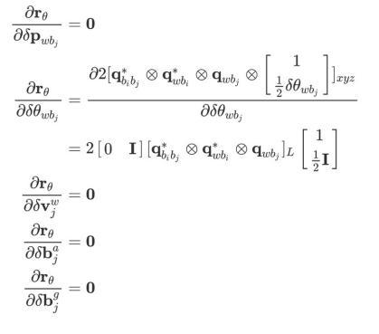

#### 速度velocity残差雅可比

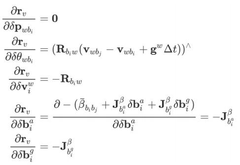
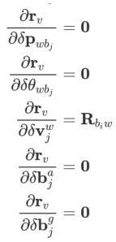

#### 加速度acc bias残差雅可比

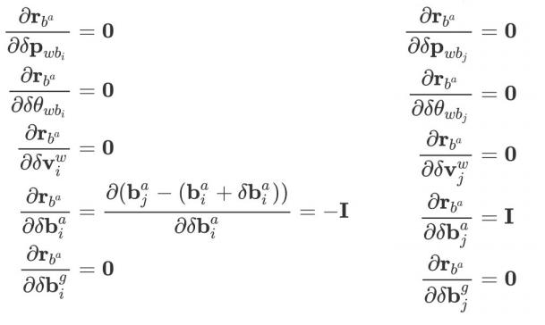

#### 角速度gyro bias残差雅可比

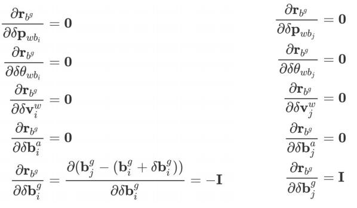


**补全代码**

### Code updated

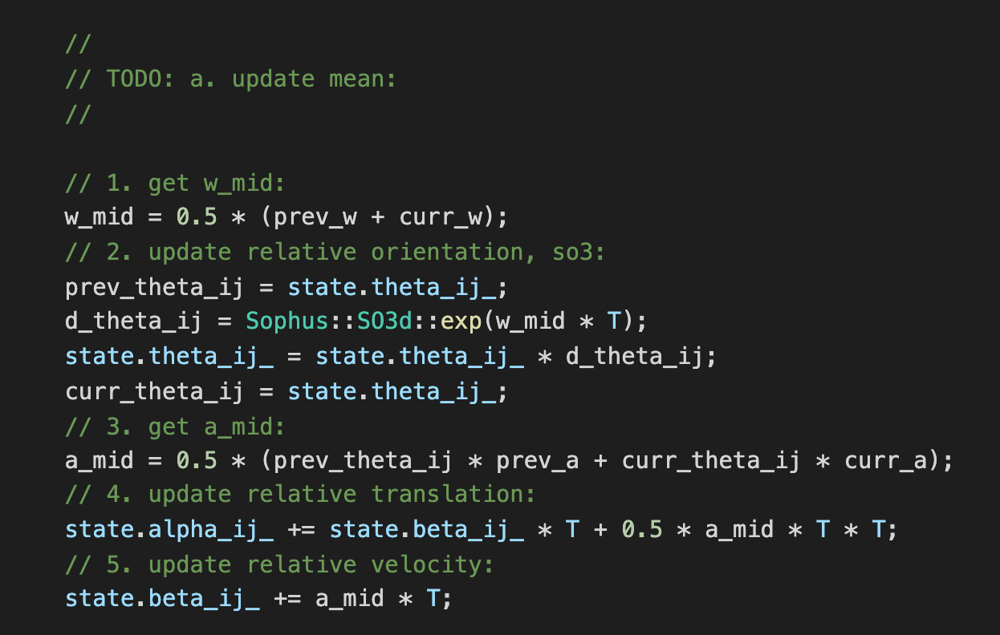

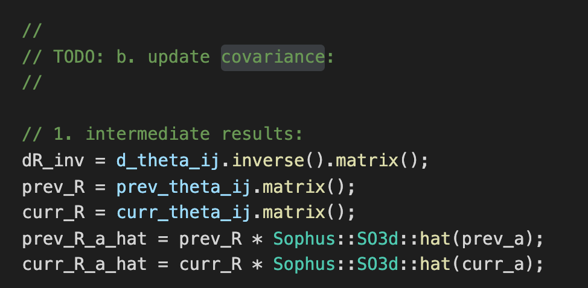

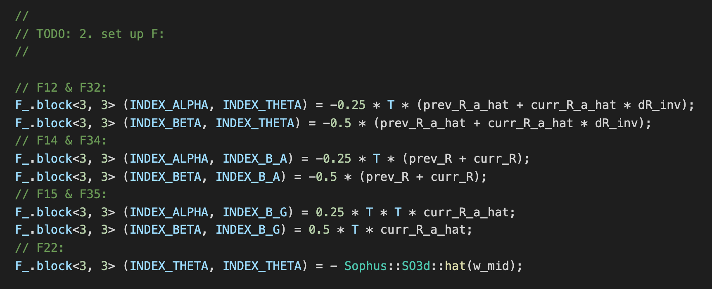

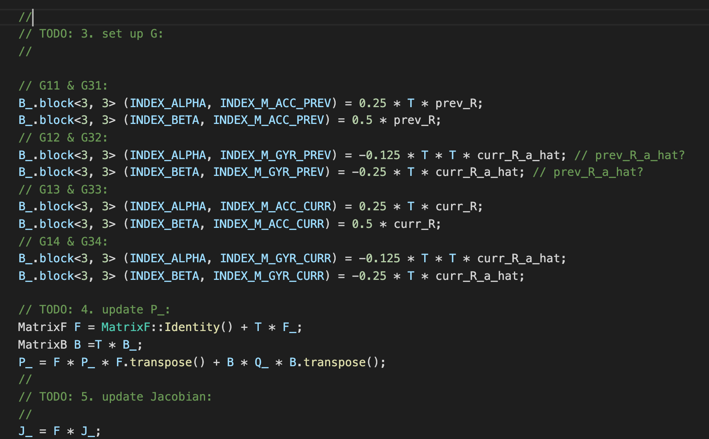


### Compilation & Running

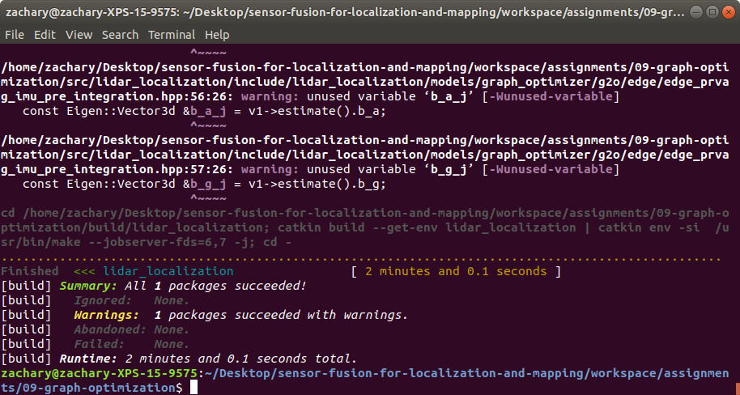

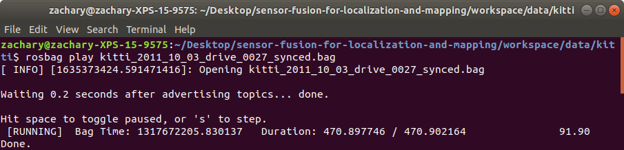


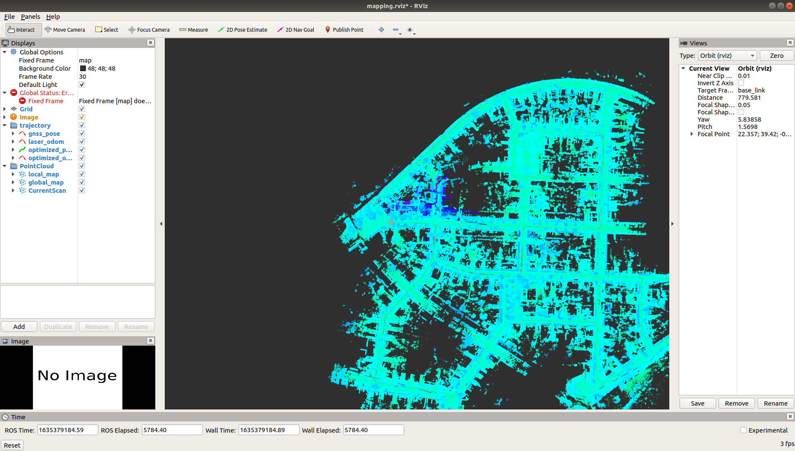

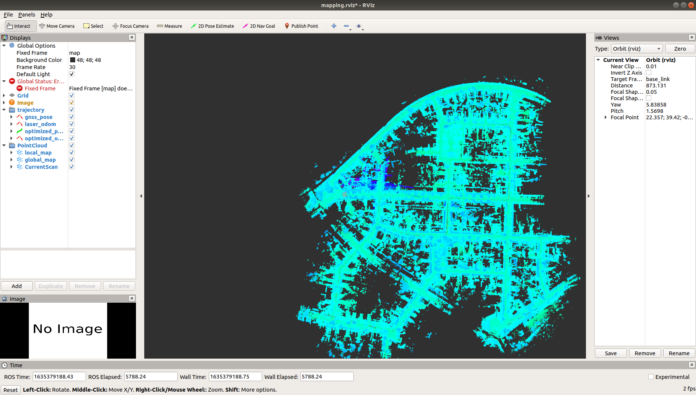

### 良好要求: 在及格基础上, 实现和不加IMU时的效果对比和分析

**备注**

1. 对比是全方位的, 既包括轨迹精度的对比, 也包括地图质量的对比(因为IMU会增加估计的平滑性)；
2. 由于数据集的老问题, 部分指标可能与预期不一致, 且地图质量无法量化, 因此给出自己的分析即可.

干就完了! 期待你的精彩发挥.

## Answers:

in the directory: [here](src/lidar_localization/slam_data/trajectory)

```bash
# run evo evaluation:
# a. laser:
evo_ape kitti ground_truth.txt laser_odom.txt -r full --plot --plot_mode xy
# b. fused:
evo_ape kitti ground_truth.txt optimized.txt -r full --plot --plot_mode xy
```
### laser_odom:

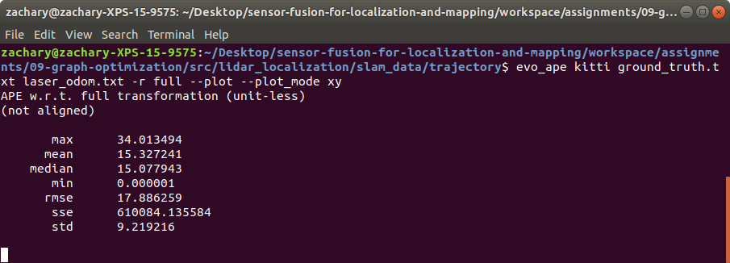

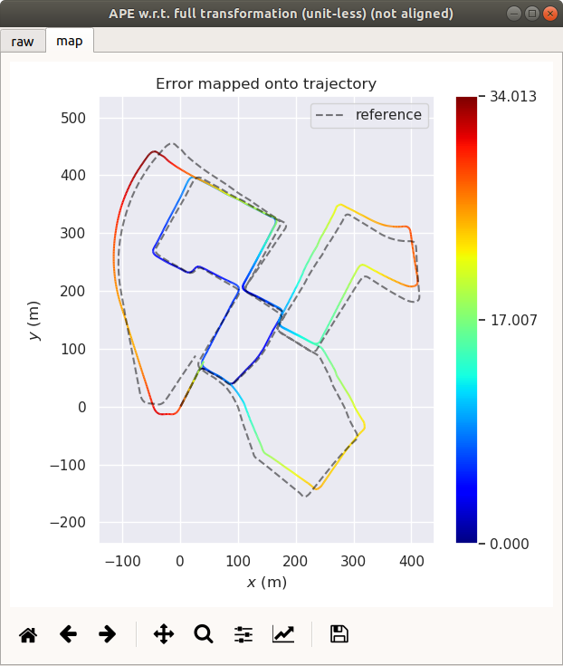

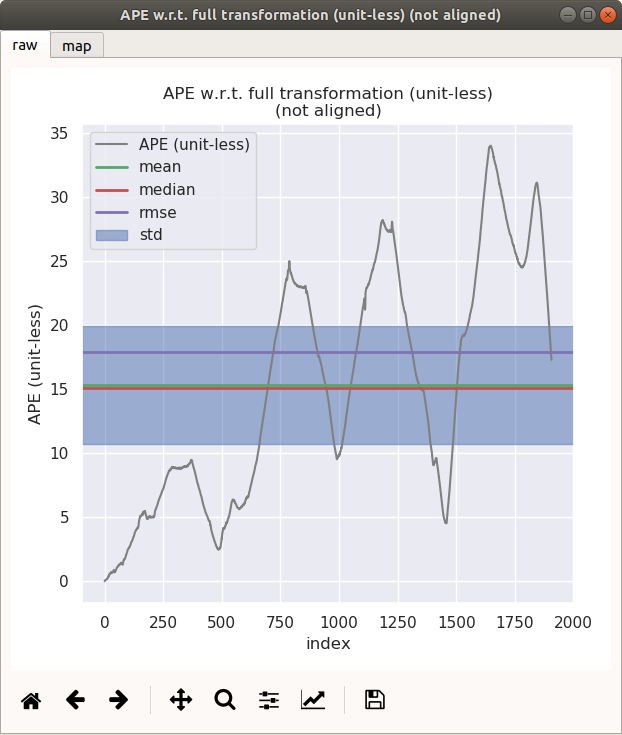

### optimized:

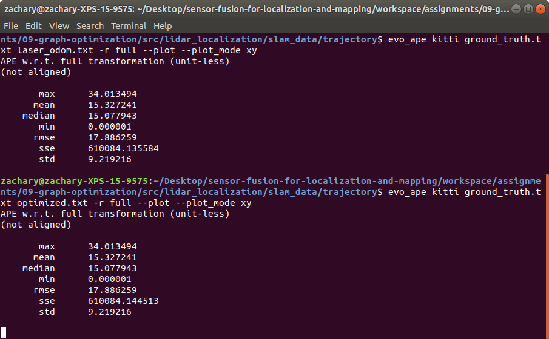

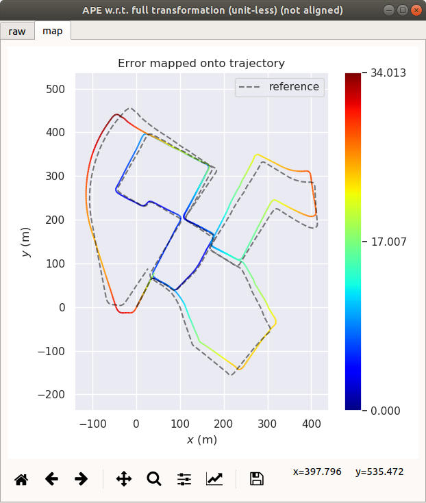

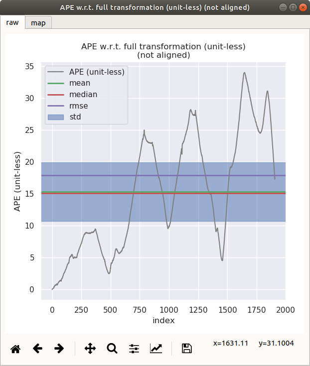


Comparing the before and the after IMU engaged, I found that the overall accuacy did not change apparently. This may be the IMU source data was modified by Kitti. Also, the globle mapping may smooth the minor changes, which overwhelmed the optimaization updates. 


### 优秀要求: 在良好的基础上，完成融合编码器时预积分公式的推导(方差递推、残差对状态量雅可比、bias更新等)

如果理论知识有较大欠缺, 推荐参考深蓝学院VIO课程中的相关内容